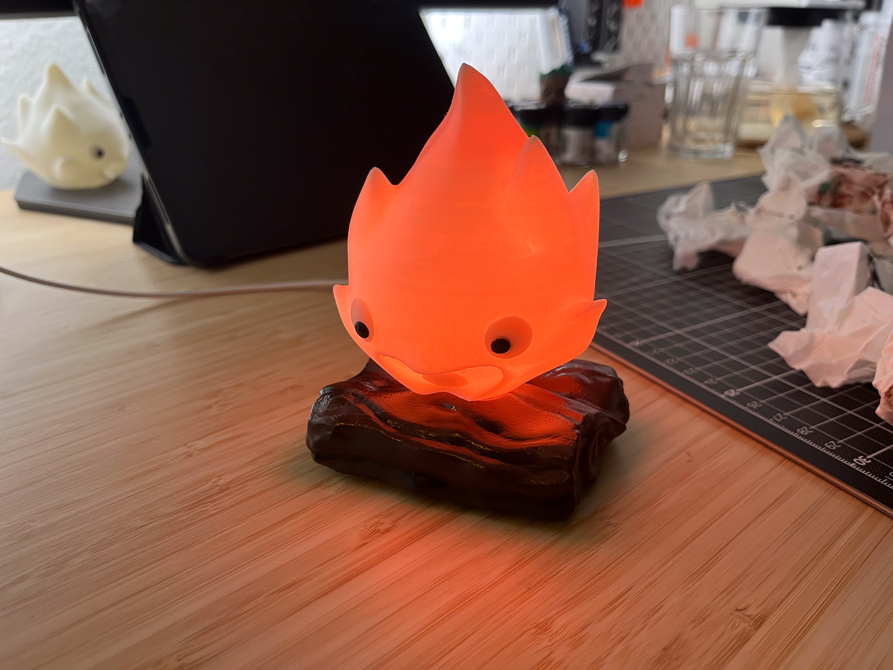

# Calcifer LED-Lamp

This Repository contains information on the hard- and software of a LED-Lamp in the shape of Calcifer from the movie [Howl's Moving Castle](https://en.wikipedia.org/wiki/Howl%27s_Moving_Castle_(film)) by [Hayao Miyazaki](https://en.wikipedia.org/wiki/Hayao_Miyazaki).



## Acknowledgements

The 3d print files are based on [CosmicNimbus's](https://makerworld.com/de/@CosmicNimbus) [Calcifer Lamp]('https://makerworld.com/de/models/551520-calcifer-lamp-bbl-led-kit-modified?from=search#profileId-470077') but were heavily modified to fit the requirements. My files can also be found on [printables](https://www.printables.com/model/1315251-calcifer-led-lamp).

During software development, I often used github copilot in VS Code to speed up development. I am not a software dev, but the code worked as intended so far. The libraries and frameworks used are listed in the ```platformio.ini```-file.

## Build

After 3d-printing all the parts, I used a hot-air station set at about 70 °C to soften up the eyes printed flat on the print bed. Once the desired curve has been archived, the eyes and the iris were glued on the main Calcifer body with epoxy.

Generic sticks of 8 WS2812B-LEDs each were soldered up and glued to the LED-Mount. A single WS2812B was glued on top. After that the LOLIN ESP32 S3 mini, the USB-C Jack, a 1000µF capacitor and a 3A fuse were soldered and mounted in the case. Three patches of copper tape soldered to the touch-inputs of the ESP32 are used as the user interface. The case is designed for heat-set inserts.

After sanding and a primer base coat, the paint job was applied.

The base was printed in white PLA. Calcifer was printed in glow-in-the-dark PLA.